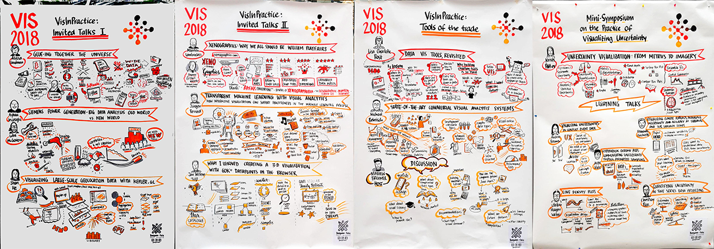
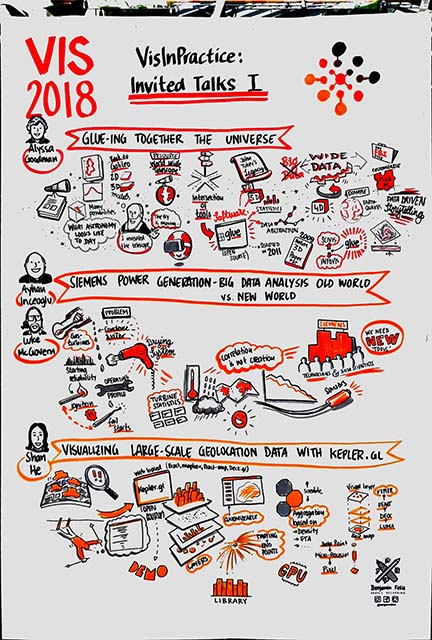
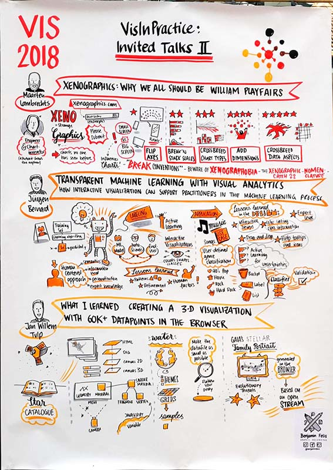
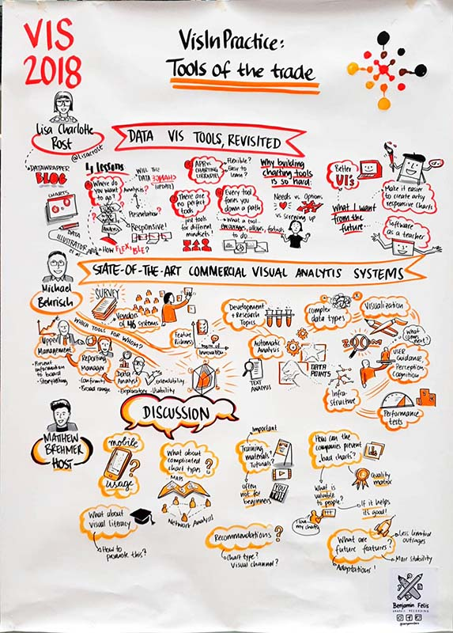
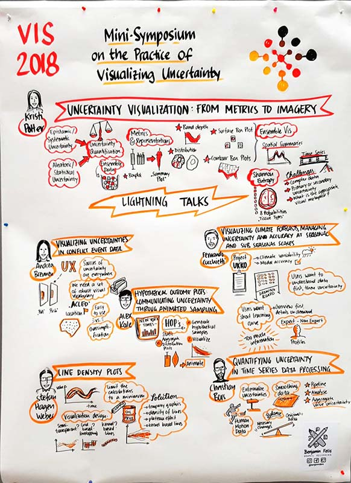

{::options parse_block_html="true" /}

# Graphic Recording

This year's VisInPractice Program was visually recorded by artist [Benjamin Felis](https://benjaminfelis.com/). Click on an image for a larger view. 

 
This work has been kindly supported by 

# VisInPractice Invited Talks I

# VisInPractice Invited Talks II

# VisInPractice: Tools of the Trade

# Mini-Symposium on the Practice of Visualizing Uncertainty

---