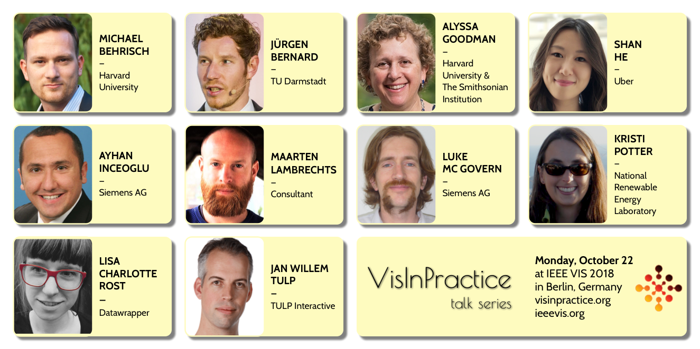

---
# You don't need to edit this file, it's empty on purpose.
# Edit theme's home layout instead if you wanna make some changes
# See: https://jekyllrb.com/docs/themes/#overriding-theme-defaults
layout: default
title: Home
---
{::options parse_block_html="true" /}

<!-- # Visualization in Practice 2018  -->

The [VisInPractice 2018 Program](program.html) at **[IEEE VIS](http://ieeevis.org)** features three sessions of invited talks by visualization practitioners on **Monday, October 22nd, 2018** in **Estrel A**.  

<a target="" alt="Michael Behrisch" title="Michael Behrisch" href="program.html#behrisch" style="top: 0%; left: 0%; width: 25%; height: 33%;">
<a target="" alt="Jürgen Bernard" title="Jürgen Bernard" href="program.html#bernard" style="top: 0%; left: 25%; width: 25%; height: 33%;">
<a target="" alt="Alyssa Goodman" title="Alyssa Goodman" href="program.html#goodman" style="top: 0%; left: 50%; width: 25%; height: 33%;">
<a target="" alt="Shan He" title="Shan He" href="program.html#he" style="top: 0%; left: 75%; width: 25%; height: 33%;">
<a target="" alt="Ayhan Inceoglu" title="Ayhan Inceoglu" href="program.html#inceoglu" style="top: 33%; left: 0%; width: 25%; height: 33%;">
<a target="" alt="Maarten Lambrechts" title="Maarten Lambrechts" href="program.html#lambrechts" style="top: 33%; left: 25%; width: 25%; height: 33%;">
<a target="" alt="Luke Mc Govern" title="Luke Mc Govern" href="program.html#inceoglu" style="top: 33%; left: 50%; width: 25%; height: 33%;">
<a target="" alt="Kristi Potter" title="Kristi Potter" href="program.html#potter" style="top: 33%; left: 75%; width: 25%; height: 33%;">
<a target="" alt="Lisa Charlotte Rost" title="Lisa Charlotte Rost" href="program.html#rost" style="top: 67%; left: 0%; width: 25%; height: 33%;">
<a target="" alt="Jan Willem Tulp" title="Jan Willem Tulp" href="program.html#tulp" style="top: 67%; left: 25%; width: 25%; height: 33%;">
<a target="" alt="VisInPractice 2018 Program" title="VisInPractice 2018 Program" href="program.html" style="top: 67%; left: 50%; width: 50%; height: 33%;">

The **VisInPractice** program is an opportunity for visualization practitioners and researchers to meet and share experiences, insights, and ideas in applying visualization and visual analytics to real-world use cases. It also features a fast-paced, single-session [mini symposium on uncertainty visualization](program.html#symposium). VisInPractice seeks to acknowledge successful transfers of visualization research into applications as well as current visualization practices in industry. 

# Thank You
Vis in Practice was held on October 22 in Berlin, Germany.
We are looking back at a very lively event. 
Thank you all for participating.
Please let us know how you [<b>liked it.</b>](https://aka.ms/vipfeedback)