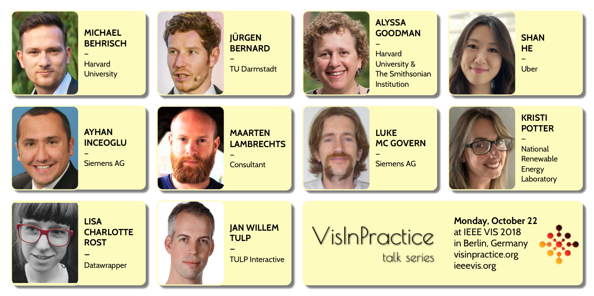
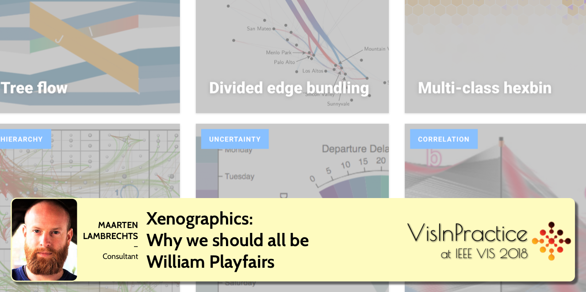

{::options parse_block_html="true" /}

# Program: Monday, October 22, 2018 (9am - 6pm) in Estrel A

The entire VisInPractice program is dedicated to everyone interested in the **practical aspects of data visualization and visual analytics**. The focus will be on how to solve real use cases rather than discussing them from an academic perspective. The program targets both newcomers to visualization and visual analysis as well as returning members of the community seeking to learn about new tools and practices.

**Click on a speaker to see their talk title, abstract, and bio**:

# At-a-Glance Schedule

**Session1**: 9:00 - 10:40 - [VisInPractice Invited Talks I](#talks-1)
* Alyssa Goodman - [_glue-ing Together the Universe_](#goodman)
* Ayhan Inceoglu and Luke Mc Govern - [_Siemens Power Generation – Big Data Analysis Old World vs. New World_](#inceoglu)
* Shan He - [_Visualizing large-scale geolocation data with kepler.gl_](#he)

__morning coffee break__

**Session 2**: 11:00 - 12:40 - [VisInPractice Invited Talks II](#talks-2)
* Maarten Lambrechts - [_Xenographics: Why we should all be William Playfairs_](#lambrechts)
* Jürgen Bernard - [_Transparent Machine Learning with Visual Analytics: How Interactive Visualization can Support Practitioners in the Machine Learning Process_](#bernard)
* Jan Willem Tulp - [_What I Learned Creating a 3D Visualization with 60K+ Datapoints in the Browser_](#tulp)

__lunch break__

**Session 3**: 14:20 - 16:00 - [VisInPractice: Tools of the Trade](#tools)
* Lisa Charlotte Rost - [_Data Vis Tools, Revisited_](#rost)
* Michael Behrisch - [_State-of-the-art of Commercial Visual Analytics Systems_](#behrisch)
* All - _Open Discussion_

__afternoon coffee break__

**Session 4**: 16:20 - 18:00 - [Mini-Symposium on the Practice of Visualizing Uncertainty](#symposium)
* Kristi Potter - [_Uncertainty Visualization: From Metrics to Imagery_](#potter)
* [Lightning Talks](#lightning)

# VisInPractice Invited Talks I 
## 9:00 - 10:40 - Chair: Daniela Oelke

**SPEAKER**: [Alyssa Goodman](https://www.cfa.harvard.edu/~agoodman/), Harvard University, the Radcliffe Institute for Advanced Study, and the Smithsonian Institution

**ABSTRACT**: Astronomers have a long history of visualization. Going back only as far as Galileo, discoveries were made using sketches of celestial objects moving over time. Today, Astronomy inquiries can, and often do, make use of petabytes of data at once. Huge surveys are analyzed statistically to understand tiny fluctuations that hint at the fundamental nature of the Universe, and myriad data sets, from telescopes across the globe and in space are brought together to solve problems ranging from the nature of black holes to the structure of the Milky Way to the origins of planets like Earth. In this talk, I will summarize the state of partnerships between astronomical, physical, and computational approaches to gleaning insight from combinations of scientific and information visualization in Astrophysics. In particular, I will discuss how the “glue” linked-view visualization environment ([glueviz.org](http://glueviz.org)), developed originally to facilitate high-dimensional data exploration in Astronomy and Medicine, can be extended to many other fields of data-driven inquiry. In addition, I will explain how the current open-source, plug & play, approach to software facilitates the combination of powerful programs and projects such as glue, WorldWide Telescope, ESASky, and the Zooniverse Citizen Science platform.   Throughout the talk, I will emphasize the commonalities amongst many fields of science that rely on high-dimensional data.  Scientists do not draw distinctions between “scientific visualizations” that show literal spatial dimensions, and “information visualizations” that characterize non-spatial and/or statistical aspects of data.  My goal will be to leave Vis attendees with an appreciation of the powerful discovery opportunities offered to scientists when visualization types developed by the InfoVis, SciVis, and VAST communities can be connected in the kind of flexible, linked-view high-dimensional visualization  environment offered by glue.

**SPEAKER BIO**: [Alyssa Goodman](https://www.cfa.harvard.edu/~agoodman/) is the Robert Wheeler Willson Professor of Applied Astronomy at Harvard University, coDirector for Science at the Radcliffe Institute for Advanced Study, and a Research Associate of the Smithsonian Institution. Goodman's research and teaching interests span astronomy, data visualization, prediction, and online systems for research and education. Goodman received her undergraduate degree in Physics from MIT in 1984 and a Ph.D. in Physics from Harvard in 1989. Goodman was awarded the Newton Lacy Pierce Prize from the American Astronomical Society (AAS) in 1997, appointed Scholar-in-Residence at WGBH in 2008-9, named Fellow of the American Association for the Advancement of Science in 2009, chosen as Scientist of the Year by the Harvard Foundation in 2015, and awarded a Fellowship at Radcliffe in 2016-17.  She served as the Founding Director of the Harvard Initiative in Innovative Computing from 2005-8, and she presently serves on the Steering Committee of Harvard’s Data Science Initiative.  Goodman has served as Chair of the Astronomy Section of the American Association for the Advancement of Science, on the National Academy's Board on Research Data and Information, and on the NSF’s Big Data, Ethics, and Society Council. Goodman's astronomical research presently focuses primarily on new ways to visualize and analyze the tremendous data volumes created by large and/or diverse surveys, and on improving our understanding of the structure of the Milky Way Galaxy. She also leads the PredictionX project, which is creating and assembling materials tracing methods for predicting the future from antiquity to the present.  Goodman serves as key advisor for WorldWide Telescope (first at Microsoft Research, now at the AAS), and she co-invented the linked-view visualization environment known as “glue,” used by astronomers, medical researchers, geographers, and others.

**SPEAKER**: Ayhan Inceoglu and Luke Mc Govern, Siemens AG

**ABSTRACT**: The presentation from Ayhan Inceoglu and Luke Mc Govern from Siemens AG will be in two parts. In part one Ayhan will give a brief overview of our business and the workings of a gas turbine. He will then bring up a case study from 2005 about a fleet issue and how it was solved through expert analysis and some intuition. In part two Luke will explain discuss how the Power Generation division within Siemens has advanced in the area of data analytics and big data in the last years. Such as increased usage of tools such as Tableau and QLik along with a more integrated data and information landscape. He will then show how the case study from before might have been solved more quickly thanks to the interconnected data. Visualizations of large diverse data sets together with machine learning can help to find solutions to all manner of problems.
But expert knowledge is still required to separate correlation and causation.

**SPEAKER BIOS**: Luke Mc Govern completed his studies in Ireland in 2006 and moved to Berlin in 2008 where he started working for Siemens AG. Between 2008 and 2013 he processed data and generated statistical reports the operation and maintenance gas turbine fleet. From 2013 to 2016 he took a pioneering role in the integration of more in depth data analytics techniques into the Power Diagnostics group. Now he is part of the research and development project team whose goal it is to find new and innovative solutions to the data problems of the future. He is in the process of completing a distance master’s in electrical engineering, his thesis is to use statistical and learning techniques to forecast solar and wind energy generation.

Ayhan Inceoglu joined Siemens in 2001 as a Fleet Data Engineer and Data Analyst. Between 2001 and 2012 he gained experience in data analytics in the Gas Turbine Service Engineering and the Product Integrity organizations. Now he is part of the Siemens Fleet Data Management group whose goal it is to collect, validate, maintain and analyze operational data for Gas Turbines, Steam Turbines as well as Generator. He completed his Six Sigma Green Belt certificate in 2010 and is planning to become a Black Belt in 2018. He regularly gives lectures on the GT seminars for "Siemens Power Plant Availability and Reliability". He also worked in the scientific area and contributed a chapter "Operating Data Analysis" for the book "Stationäre Gasturbinen" (Stationary Gas Turbines). He was appointed as Expert for Data Analytics in June 2017.

**SPEAKER**: [Shan He](http://shanhe.io/), Uber

**ABSTRACT**: [Kepler.gl](http://kepler.gl) is a data-agnostic, high-performance web-based application for visual exploration of large-scale geolocation datasets. Built on top of deck.gl, kepler.gl can render millions of points representing thousands of trips and perform spatial aggregations on the fly.

Kepler.gl is built for users with a variety of experience and skill levels to navigate the vast amount of geospatial data and create meaningful data visualizations. Showing geospatial data in a single web interface, kepler.gl helps users quickly validate ideas and glean insights from these visualizations. Using kepler.gl, a user can drag and drop a CSV or GeoJSON file into the browser, visualize it with different map layers, explore it by filtering and aggregating it, and eventually export the final visualization as a static map or an animated video. Instead of spanning multiple browsers and consuming weeks of work at a time, the entire trial and error process occurs place in one user interface and can take as little as 10 minutes!

Not only a powerful geo-visualization application, kepler.gl is also a framework built with React and Redux to be embedded into other application as map components. This talk will introduce the idea behind kepler.gl, why and how did we build it. For researchers in various domains, I will demonstrate how to quickly prototype and verify new research ideas for geo temporal spatial data at scale.  For developers who build domain-specific tools, this is also an end-to-end story on how to build such web-based authoring/workflow tool with task-oriented justifications.

**SPEAKER BIO**: Shan is a senior data visualization engineer at Uber. She is a coder, a designer, and a data artist. Shan is the founding member of Uber's data visualization team. At Uber, she builds data tools and platforms to make business intelligence easy to access, creates exploratory data visualizations to facilitate data analysis and modeling, and publishes public facing graphics and animations to tell data stories about Uber. Prior to joining Uber, Shan studied at MIT and received a master in design computation while conducting research at the MIT Senseable City Lab as data visualization specialist. Shan is the author of kepler.gl, an open sourced data visualization tool, for visualizing large-scale geospatial data on the web.

# VisInPractice Invited Talks II 
## 11:00 - 12:40 - Chair: Matthew Brehmer

**SPEAKER**: [Maarten Lambrechts](http://www.maartenlambrechts.com/), consultant

**ABSTRACT**: Data sets people work with today are bigger and more complex then ever. Visualising this data requires new visualisation techniques and chart types, but the adoption of these is a very slow process. To help the dissemination of new techniques in visualisation, Maarten started xeno.graphics, a collection of less common and innovative visualisations. While collecting the examples, Maarten gathered some insights about these "weird charts".

In his talk, Maarten will share many of the xenographics to illustrate these insights. Drawing parallels with William Playfair and his work, he will discuss conventions in visualisation, conservatism in visualisation, chart type names, killing bad ideas and the research-practice gap.

**SPEAKER BIO**: Maarten is a data journalist and visualisation consultant. A tortuous carreer path brought him from graduating as a bio-engineer in forestry and nature conservation to working as a data journalist at Belgian newspaper De Tijd. He is now working as a freelancer: he designs and develops visualisations, helps to build visualisation tools and gives trainings and workshops. Check his portfolio on his website ([maartenlambrechts.com](http://www.maartenlambrechts.com/)) or follow him on twitter ([@maartenzam](https://twitter.com/maartenzam)).

**SPEAKER**: Jürgen Bernard, TU Darmstadt

**ABSTRACT**: Machine Learning is a key technology in the era of data-centered applications. Effective Machine Learning models have been trained in the past, that ease our everyday life or gain other types of promising benefits. Today, in many cases humans still do not fully understand how these models have been trained, why these models predict a particular output for a given input instance, or whether predictions of these models always reflect humans’ notion of judgement in a meaningful way. This talk addresses two remaining challenges of many practitioners to a) understand the output of Machine Learning models and b) play a more active role in the Machine Learning process. I will demonstrate that Visual Analytics is a promising approach to address these challenges. The overall principle is to combine meaningful visualization and interaction designs with automated data analysis and learning-support techniques. My application examples will focus on the data-labeling problem. Machine Learning models require information (labels) about instances before they can be trained – providing those labels is often a tedious, unsatisfactory process for human labelers. "Visual-Interactive Labeling (VIAL)" includes the class of Visual Analytics approaches that make the data labeling and Machine Learning process a visual-interactive experience – for experts and non-experts. With VIAL, users have visual-interactive means to a) assign labels to data, b) participate in the iterative Machine Learning process, and c) validate the output of Machine Learning models.

**SPEAKER BIO**: Jürgen Bernard is Post-doc at TU Darmstadt, Germany. He was with Fraunhofer IGD when he received is PhD degree in 2015. His research is in information visualization and visual analytics with an emphasis on medical health care and other applications requiring data-driven research. His data-centered focus is on time-oriented data and high-dimensional data. Many of his visual-interactive solutions combine techniques from cluster analysis, dimensionality reduction, similarity search, active learning, or other machine learning techniques.

**SPEAKER**: [Jan Willem Tulp](http://tulpinteractive.com/), Tulp Interactive

**ABSTRACT**: Creating 3D visualizations using WebGL in the browser requires some other strategies than for instance creating 2D SVG visualizations with D3. Using several projects as examples, I will explain some of the technical and design choices that I've made. For instance, what parts are run in shaders, and what parts are not? Or, how to achieve crisp looking texts? And, when combining with D3, what parts are made in D3 and what parts in WebGL, and why?

**SPEAKER BIO**: Jan Willem Tulp is a independent Data Experience Designer from The Netherlands. With his company TULP interactive he creates custom data visualizations for a variety of clients. For more than 6 years he has helped clients such as Google, the European Space Agency, Scientific American, Nature, and the World Economic Forum by creating visualizations, both interactive and in print. His work has appeared in several books and magazines and he speaks regularly at international conferences.

# VisInPractice: The Tools of the Trade 
## 14:20 - 16:00 - Chair: Matthew Brehmer

The early afternoon session will focus on the question of what is possible with established visualization and visual analytics tools.

**SPEAKER**: [Lisa Charlotte Rost](https://lisacharlotterost.de/), Datawrapper

**ABSTRACT**: Two years ago, I tried to recreate the same chart with 24 different data vis tools: 12 apps (like Plotly, Adobe Illustrator or RAW) and 12 programming languages/frameworks (like d3.js, Vega-Lite, ggplot2 or Matplotlib). I then wrote a blog post summing up what I learned thanks to this experiment. In my talk, I want to revisit my insights from back then. What do I see differently now? Which new tools have entered the pool? Which ones died a silent death? Which ones have improved the most in the last two years? And since tools are supposed to make it easier to visualize data: Has it become easier, actually? If I do a good job, you'll get an overview of the landscape of data vis tools and some new ideas how to think about them. And you'll learn what to tell the strangers who email you and ask which data vis tools they should start to learn.

**SPEAKER BIO**: Lisa Charlotte Rost is a designer at Datawrapper, who's been writing and talking about data vis for a few years. In 2016 Lisa was an OpenNews Fellow at NPR in Washington, DC. Before that, she created data visualizations for newsrooms like Tagesspiegel, Bloomberg, SPIEGEL & ZEIT Online. Based in Berlin now, she organizes the Data Vis meetup and spends way too much time on [Twitter](https://twitter.com/lisacrost).

**SPEAKER**: [Michael Behrisch](http://michael.behrisch.info), Harvard University

**ABSTRACT**: Commercial Visual Analytics systems are becoming omnipresent in our data analysis life. However, the challenging question for business and academic users is "Which tool should be used in the data analysis scenario at hand?" Five years after the first state-of-the-art report on Commercial Visual Analytics Systems we present a reevaluation of the Big Data Analytics field. We build on the success of the 2012 survey, which was influential even beyond the boundaries of the InfoVis and Visual Analytics (VA) community. We assess new product versions on established evaluation criteria, such as available features, performance, and usability, to extend on and assure comparability with the previous survey. We also investigate previously unavailable products to paint a more complete picture of the commercial VA landscape and introduce novel measures, like suitability for specific user groups. We explore the achievements in the commercial sector in addressing VA challenges and propose novel developments that should be on systems’ roadmaps in the coming years. The goal of this talk will be to give an understanding how the systems' feature sets, approaches and developments can be comparatively evaluated. With this tool set you will be better prepared in the decision which commercial visual analytics system to choose for your real-world analysis scenarios.

**SPEAKER BIO**: Dr. Michael Behrisch is a Postdoctoral Researcher with the Visual Computing Group at the Harvard University Cambridge, USA since 2017. His research interest include the visualization of relational data, pattern analysis in visualizations, and user-centric exploration approaches for large data spaces. He received his PhD. in Computer Science from the University of Konstanz, where he worked from 2011 until 2017 as a Research Associate in the Data Analysis and Visualization Group.

## Open Discussion of Visualization Tools

# Mini-Symposium on the Practice of Visualizing Uncertainty 
## 16:20 - 18:00 - Chair: Bernd Hentschel

In the late afternoon, we will coordinate a fast-paced session that brings participants up to speed with the practical aspects of uncertainty visualization. To this end, we will begin this session with a **30-minute primer** by [Kristi Potter](https://www.nrel.gov/research/kristi-potter.html) of the National Renwewable Energy Laboratory on the topic that specifically highlights challenges and established approaches. Following this primer will be a set of **five 10-minute lightning talks**, each of which outlines a working solution from a practical setting. 

**SPEAKER**: [Kristi Potter](https://www.nrel.gov/research/kristi-potter.html), National Renewable Energy Laboratory (NREL)

**ABSTRACT**: Uncertainty is ubiquitous in scientific data. Aberrations such as variability, error, and missing data are key characteristics providing insights into the reliability of a given dataset. Without this information, data is often considered incomplete; however many visualizations do not include uncertainty due to increased complexity in the visual design. In my own work, I often encounter uncertainty stemming from large-scale, multi-run simulations where the variability between simulation runs reflects the range of possible outcomes. My approach to these problems often include multiple linked-windows, color mapping, and contouring, as well as more sophisticated, but domain-specific methods.

In this talk, I will go over the basics of uncertainty characterization and the challenges in including uncertainty in data visualization. I will briefly cover the types of uncertainty and the mathematical metrics most often used to measure uncertainty for visualization purposes including descriptive statistics and probability distributions. I will also provide a short history of uncertainty visualization techniques and a small subset of modern approaches that are easily applied in readily available software. Finally, I discuss my own work in ensemble visualization including the tools and techniques used to produce the resulting visualizations.

**SPEAKER BIO**: Dr. Kristi Potter is a Senior Scientist specializing in data visualization at NREL. Her current research is focused on methods for improving visualization techniques by adding qualitative information regarding reliability to the data display. This work includes researching statistical measures of uncertainty, error, and confidence levels, and translating the semantic meaning of these measures into visual metaphors. She is also interested in topics related to decision making, performance visualization, method evaluation, and application specific techniques. Kristi has over 15 years of experience in visualization creation, design and deployment spanning multiple disciplines including atmospheric sciences, materials modeling, geographical mapping, and the humanities. Prior to joining NREL in 2017, she worked as a research computing consultant at the University of Oregon providing visualization services, computational training and education, and other support to researchers across campus, and as a research scientist at the University of Utah, working on projects related to the visualization of uncertainty and error in data. Her dissertation work focused on the visual representation of variability within ensemble suites of simulations covering multiple parameter settings and initial conditions. Her master's work developed the use of sketch-based methods for conveying levels of reliability in architectural renderings. Kristi is currently working in NERL's Insight Center on high-dimensional data visualization techniques and web-based deployment of visualization applications. 

## Lightning Talks

---
## Visualizing Uncertainties in Conflict Event Data
**ABSTRACT:** Today's visualization tools offer few capabilities or standards for conveying uncertainty, particularly in geospatial data. This gap creates an obstacle to meaningful use and integration of publicly available digital data sources, which vary considerably in quality and reliability. The question that motivated this project was: how can we use visualization to make a publicly-available dataset actionable, when we know that it contains uncertainties?

In this presentation, I will show a prototype application that we built to help users explore the Armed Conflict Location and Event Data Project (ACLED), a publicly-available repository of conflict events. This data contains multiple types of uncertainty including the precise timing and location of events, estimated fatality counts, and varying reliability of information reported by different news outlets.

Our goal was to visualize this data in a way that made its uncertainties transparent to users. To do this, we created a taxonomy of different types of uncertainty and deployed multiple linked visualization techniques - a rug plot, a hypothetical outcome plot, a timeline, and a new technique that we call "wandering dots" - to help users explore, isolate, and differentiate between different types of uncertainty in the data.

Ultimately, we want to improve our ability to make effective, validated design choices about how and when to visualize uncertainty. Following our work on this prototype, we developed a scalable test instrument to collect empirical data on how users respond to different uncertainty visualization techniques. We presented the results of an initial user study at CHI 2018 and are currently pursuing further work in this area.

**SPEAKER:** Andrea Brennen, IQT Labs

---
## Visualizing Climate Forecasts, Managing Uncertainty and Accuracy at Seasonal and Sub-Seasonal Scales
**ABSTRACT:** 
_RESILIENCE_ is a visualisation tool that displays geolocated seasonal and sub-seasonal forecasts of climate variables. Uncertainty depends on the predictability of climate at those time scales, and on the accuracy of the models (skill).
The tool targets renewable energy traders who need to hedge their decisions based on the prediction spread and the accuracy of past climate predictions: Is the wind expected to be below its historical values? Should we buy alternative energy sources?
Each data point is shown as a glyph (circle) in a map. The color of the glyph conveys the main forecast using a three category (above, below or on normal) colorblind-safe scale that works over dark/light backgrounds. Forecast uncertainty is encoded in the glyph’s size, while model uncertainty is introduced as a subtractive filter that removes data below a user-defined threshold. An on-demand display panel provides detailed location information, including historic vs prediction data and relative probability for each category.
We arrived at our solution after a multi-cycle user centred design process, validated with user interviews and eye-tracking experiments. Results show that users identify clearly and quickly regions with increasing/decreasing trends. We observed high task accuracy and understanding, with users mentioning that location of items and their interactivity was intuitive. Almost 90% of users said the information density was too high. We mitigated this with an information on demand approach, leading to a smooth learning curve; and all of the users successfully understanding the data and extracting correct conclusions, even at the most basic view.

**SPEAKER:** Fernando Cucchietti, Barcelona Supercomputing Center

---
## Hypothetical Outcome Plots: Communicating Uncertainty Through Animated Sampling
**ABSTRACT:**
Hypothetical Outcome Plots (HOPs) communicate uncertainty through an animated series of possible outcomes. The simplest approach to creating HOPs is to: (1) sample hypothetical outcomes from a distribution; (2) for each, make a plot that becomes one frame in an animation. Frequency encodings are similar to how we experience uncertain events naturally (i.e., variation over multiple observations). The visual system automatically forms accurate gist impressions of the relative frequency of events when they are attended to. In contrast, static visualizations can show uncertainty through summary statistical representations (e.g., confidence intervals), by encoding probabilities directly using density, or by presenting static ensembles. However, each of these approaches brings limitations in terms of requiring statistical training or making perception more difficult. In multiple controlled experiments, we find that HOPs are more effective than static visualizations for estimating joint probabilities and supporting accurate interpretations of uncertain data which are required to make decisions. For example, users of HOPs are able to classify trends in samples from a noisy time series more consistently than users of static alternatives. HOPs also support estimation of univariate probabilities with comparable accuracy to conventional uncertainty visualizations in most cases, despite a prevalent belief that animation is inherently ineffective. HOPs can be produced as long as the process which generated data can be simulated, through sampling from either a statistical model or observed data. Designers can apply HOPs to any set of visual encodings provided frequency is not already shown.

**SPEAKER:** Alex Kale, University of Washington

---
## Line Density Plots
**ABSTRACT:** 
Predictions under uncertainty often are realized as distributions of forecasts. To inspect the different forecasts visually, each prediction can be represented as a line plot. The degree of uncertainty at each point of time becomes apparent if the different forecasts are plotted in one chart. However, displaying multiple lines in one chart quickly results in severe overplotting, thereby camouflaging the interesting trends.

In this talk we will compare different approaches for visualizing line-based uncertainty. We thereby focus on uncertainty as a set of forecasts that all have the same realization plausibility, and which can be represented as a continuous development of a variable (i.e. can be plotted in a line chart) and share the same data domain.

We propose a method for visualizing density in a line chart with many lines that uses a line-based kernel which comes with the advantage that the course of the lines remains visible. The uncertainty aspect can be further intensified by adding a surrounding glow to each line which also emphasizes trends. The usage of a kernel smoothes the view and emulates a larger number of lines than are actually present (upsampling).
We applied the technique to a real-world application scenario of a 19-day ahead forecast of the oil price (WTI Brent) which was executed with an ensemble of 200 recurrent neural networks. The visualization of the inherent uncertainty enables the user to optimize the procurement of commodities. The solution was implemented in Javascript (D3) and embedded in a TIBCO Spotfire dashboard.

**SPEAKER:** Stefan Hagen Weber, Siemens Research

---
## Quantifying Uncertainty in Time Series Data Processing
**ABSTRACT:**
Uncertainty visualization has become an integral part of many data analysis applications, aiding practitioners in making informed decisions, particularly when uncertain aspects are involved. However, the assessment and quantification of uncertainty introduced by data processing methods is still neglected in application scenarios. Using human motion and activity recognition as an example, different machine learning and data mining routines can be applied for data processing and analysis, which change the value domain of the underlying multivariate time series.

We identify value uncertainty as the information of changes done to the value domain, e.g., by cleansing/wrangling data to make them suited for further analysis.
For domain experts to appropriately account for uncertainties in their decision making process, they need to be quantified and externalized in the visualizations.
To accomplish this, we implemented a quantification of value uncertainties from
commonly used data processing routines for time series data (e.g., smoothing operations). We also provide different aggregation methods of value uncertainties over consecutive routines in data processing pipelines by employing various uncertainty quantification techniques (e.g., statistical, bayesian, probabilistic). This allows developers of data processing pipelines as well as users of the resulting visualization to consider the results with appropriate knowledge of value uncertainty that influenced the analysis outcome. In our visual interactive environment different processing and segmentation routine results are juxtaposed, the most appropriate motion and activity recognition pipeline can be selected by the domain expert under the consideration of (a) segmentation accuracy, (b) value uncertainties introduced into the data, and (c) overall uncertainty of the result.

**SPEAKER:** Christian Bors, TU Wien
<!-- 
 -->

---